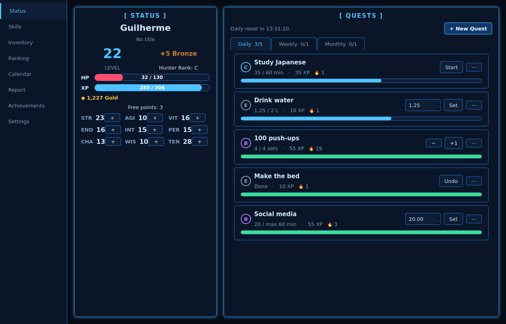

# Awaken System

App desktop (Windows) de hábitos gamificada, inspirada no "Sistema" de *Solo Leveling* e nos rankings de cultivação
de *Tales of Demons and Gods*.

- **Especificação completa:** [`docs/ESPECIFICACAO.md`](docs/ESPECIFICACAO.md)
- **Estado:** motor de regras, base de dados SQLite e interface PySide6 concluídos. A seguir: PIN, lembretes, IA opcional e `.exe`.



## Correr a app (Windows / PowerShell)
```powershell
python -m venv .venv
.venv\Scripts\activate
pip install PySide6
python -m awaken
```
Os dados ficam em `%APPDATA%\AwakenSystem\awaken.db`.

## Correr os testes (Windows / PowerShell)
```powershell
python -m venv .venv
.venv\Scripts\activate
pip install pytest PySide6
python -m pytest
```

## Simulador de equilíbrio
```powershell
python tools/simular_progressao.py            # tempos até cada ranking com os valores atuais
python tools/simular_progressao.py 100 3 1.5  # testar outra curva XP(n) = B + C × n^P
```

## Capturas de ecrã (jogo de demonstração)
```powershell
python tools/capturas.py            # gera docs/screenshots/*.png
```
